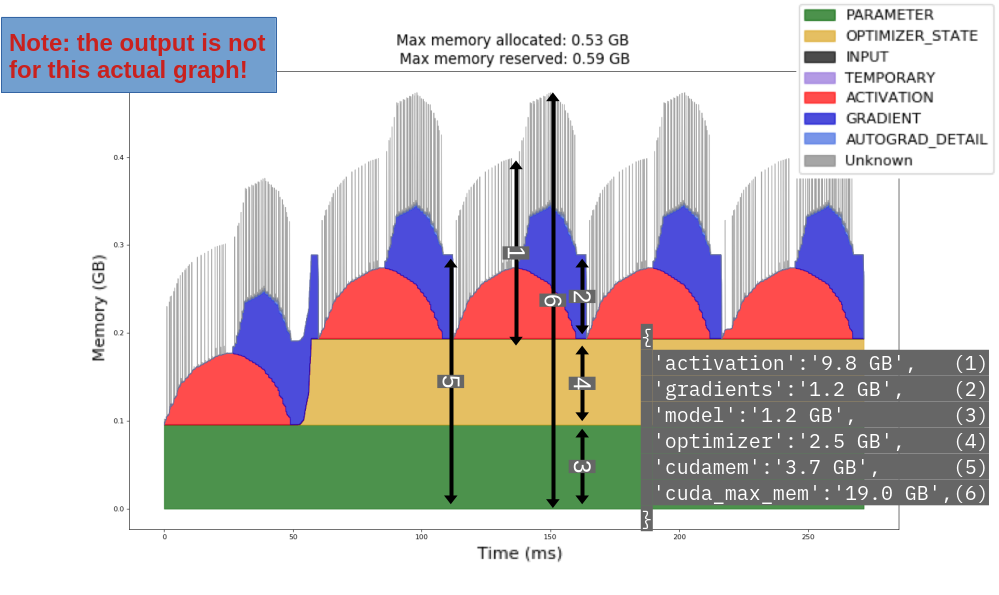

# HFResourceScanner

Scan resources consumed during training using HFTrainer and break up consumption by category with **ZERO** overheads.

Works for all training approaches (such as full-fine tuning, Prompt Tuning, LORA) for HFTrainer and other trainers based on it, such as SFTTrainer.

## Install

```
pip install .
```

## Usage

2 line change to your existing code:

1. Import the Scanner.
```
from HFResourceScanner import Scanner
```

2. Create and add a Scanner object to the list of callbacks:
```
...
callbacks.append(Scanner())
...
```

In the default configuration, prints out data to stdout.

## Features

Measures and reports GPU memory consumption broken up into 4 categories:
1. Model paramters
2. Optimizer
3. Gradients
4. Activations

## Methodology

Uses a combination of the following items:

1. HFTrainer Callbacks to measure memory and breakup at step boundary.
2. Pytorch hook functions such as `nn.Module` Forward and `optimizer.step` function to measure memory at ideal locations.



## Alternatives

1. Pytorch Profile: *very* heavy weight, can slow down severely for larger models. In comparison, our approach is the most minimalistic approach possible and scales to any model type and size.

